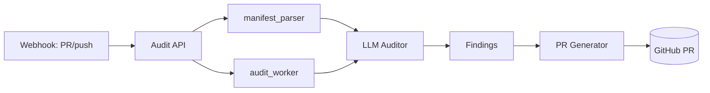

# iac-security-auditor

[](https://github.com/yakim-nick/iac-security-auditor/actions/workflows/ci.yml)

> **Engineering report** — scans Infrastructure-as-Code (Terraform / Kubernetes)
> for misconfigurations using an LLM auditor, then raises fixes as PRs. By Nick Yakim.

## 1. Problem & goal
IaC drifts into insecure states (open SGs, wildcard IAM, missing encryption).
Manual review doesn't scale. This service parses manifests, runs an LLM audit,
and proposes concrete remediations — shifting security left into the repo.

## 2. Architecture



```
 webhook / manual trigger
        │
        ▼
┌──────────────── FastAPI ────────────────┐
│ routes/webhooks.py  routes/audits.py     │
│ services/manifest_parser.py              │
│ services/llm_auditor.py  ─▶ LLM          │
│ services/pr_generator.py ─▶ GitHub PR     │
│ workers/audit_worker.py (async)          │
└───────────────────────────────────────────┘
        │
        ▼
   SQLite/Postgres (init_db)
```

## 3. Components
- `src/routes/webhooks.py` — receive PR/push events.
- `src/routes/audits.py` — audit CRUD API.
- `src/services/manifest_parser.py` — parse Terraform/K8s manifests.
- `src/services/llm_auditor.py` — LLM-based finding generation.
- `src/services/pr_generator.py` — turn findings into PRs.
- `src/workers/audit_worker.py` — background audit processing.
- `tests/` — `test_parser.py`, `conftest.py`.

## 4. Run
```bash
pip install -e .
uvicorn src.main:app --port 8000
# docker:
docker build -t iac-security-auditor .
docker-compose up
```

## 5. Testing
```bash
pytest -q
```

## 6. CI
`.github/workflows/ci.yml` — lint + pytest, least-privilege, pinned actions,
Dependabot. Security note: this service handles repo webhooks — keep secrets in
CI/secret stores, never in the image.

## Author
Nick Yakim — [github.com/yakim-nick](https://github.com/yakim-nick)
